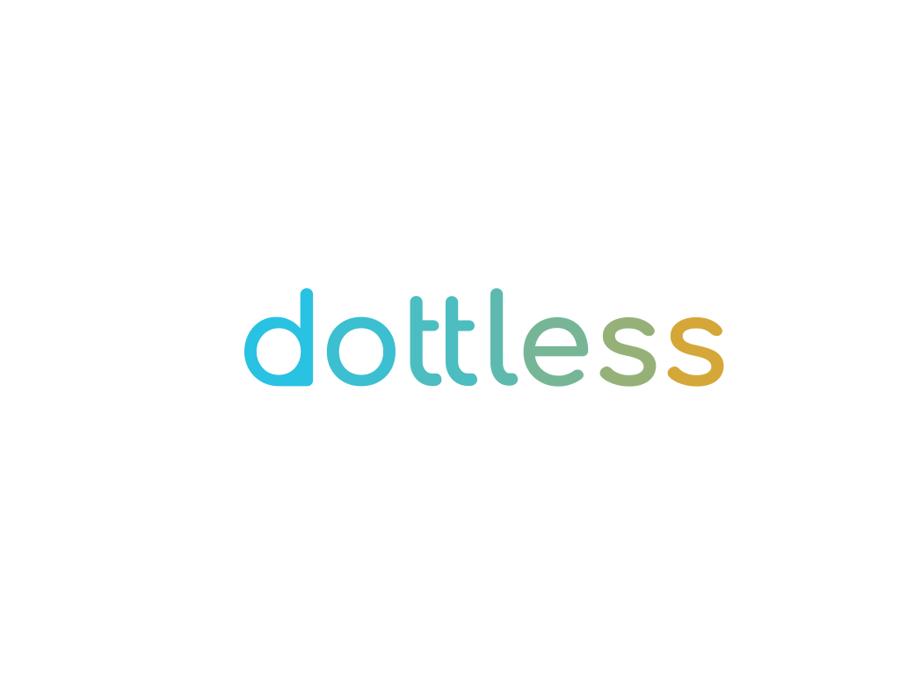

# **dotless**

_Blazing fast - workflows for the web - powered by Go, React and WebAssembly_



## **Development**

In heavy development. Not ready for production.

### **How to build**

#### **Build frontend**

```shell
yarn install
yarn build
```

#### **Build backend**

```shell
go build
```

#### **Run the app**

```cmd
run `dottless`
navigate to <http://localhost:3000>
```
---

## How to develop

// Todo

---

## How to test

// Todo
